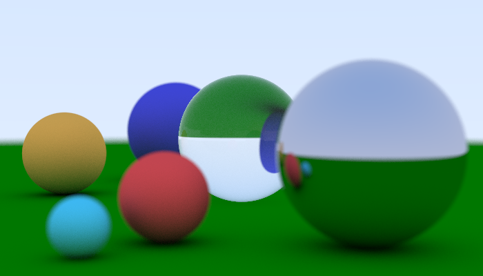

# MATLAB Ray Tracer

## What is this?
MATLAB Ray Tracer is a ray tracing software.
This software is developed based on [Ray Tracing in One Weekend](https://www.amazon.co.jp/Tracing-Weekend-Minibooks-Book-English-ebook/dp/B01B5AODD8).

## How to use?
Run "run.m".

## Notes
This software uses Parallel Computing Toolbox and Statistics and Machine Learning Toolbox.
If you don't have these toolboxes, rewrite "run.m" as follows:
- parfor -> for
- hs = haltonset(...); hs = scramble(...); -> hs = rand(2*px(1), px(2));